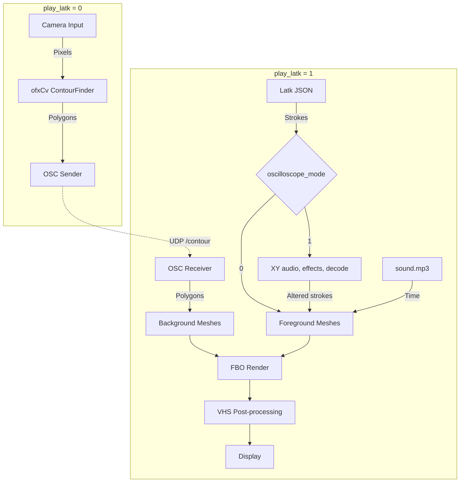

# PiLatkPlayer Architecture

`PiLatkPlayer` is an openFrameworks-based application designed for playing volumetric stroke data (Latk format) synchronized to audio, and for performing live camera-based contour detection to drive real-time networked visuals. While originally targeted for Raspberry Pi (`TARGET_RASPBERRY_PI`), it includes fallback implementations to run on other platforms like macOS and Linux.

## Core Capabilities

The application has two distinct modes of operation, determined by the `play_latk` flag in `bin/data/settings.xml`.

### 1. Latk Playback Mode (`play_latk = 1`)
In this mode, the application acts as a media player for volumetric stroke animations.
- Loads a Latk `.json` file containing 3D stroke data and an accompanying `.mp3` sound file.
- The playback of strokes is hardcoded to synchronize with specific timestamp arrays (`startTimesArray`, `stopTimesArray`), intended for progressing the animation along with spoken dialog.
- Supports stylistic effects like vertex spread/jitter (`doSpread`), custom line colors, wireframe rendering, and applying a post-processing retro VHS shader.
- **Oscilloscope mode** (`oscilloscope_mode = 1`): the strokes go through the round trip from `ofxTwoscilloscope`'s `example-transform` before they're drawn. Each stroke is encoded as a 50Hz loop of XY audio, run through a low-pass filter and a Y channel delay, and decoded back into strokes, which rounds corners and shears lines into loops. Finished strokes are cached for the rest of the frame, so only the stroke being drawn is re-encoded. No audio is played; the transform runs offline.
- Listens for incoming OSC `/contour` messages to draw background meshes, which enables multi-node collaborative visuals.
- Can optionally broadcast the current stroke points over OSC if `secondary_osc_send` is true.

### 2. Camera Contour Mode (`play_latk = 0`)
In this mode, the application acts as a computer vision sensor and OSC broadcaster.
- Captures live video feed. On Raspberry Pi, it uses the optimized `ofxCvPiCam` addon. On other platforms, it defaults to standard `ofVideoGrabber`.
- Processes the video feed in grayscale slices (based on `contour_slices`) using OpenCV (`ofxCv::ContourFinder`).
- Extracts polygons/contours from each slice and packs their vertices into binary blobs.
- Broadcasts these geometric contours over OSC (`/contour`) to other instances or networked clients.

## Application Structure

- **`src/main.cpp`**
  The entry point. Sets up the OpenGL context. It explicitly provisions OpenGL ES 2.0 when compiled for Raspberry Pi, and standard OpenGL 2.1 for desktop environments.
  
- **`src/ofApp.h` & `src/ofApp.cpp`**
  The main application class inheriting from `ofBaseApp`.
  - **`setup()`**: Loads settings from XML, initializes FBOs, camera inputs, shaders, audio, Latk playback timelines, and configures OSC senders/receivers.
  - **`update()`**: Processes pending OSC messages (converting blobs back to `ofMesh` background geometries), progresses Latk playback based on audio time, and retrieves the latest camera frames.
  - **`draw()`**: Evaluates the mode and renders accordingly. In contour mode, it slices and computes `ofxCv` contours and sends OSC packets. In Latk mode, it collects the visible strokes (passing them through `oscilloscopeTransform()` in oscilloscope mode), builds `ofMesh` representations of them with custom line width smoothing and renders them, draws incoming OSC background meshes, and finally applies post-processing shaders over the main FBO before drawing it to screen.

- **`bin/data/`**
  Contains the application's runtime assets:
  - **`settings.xml`**: Configuration file specifying network endpoints, visuals settings, input modes, thresholds, and Latk filenames.
  - **Shaders (`*.frag`, `*.vert`)**: Various GLSL shaders including `vhsc` (VHS style) implemented across ES2, ES3, GL2, and GL3 to support cross-platform deployment.
  - **Latk Files (`*.json`, `*.latk`)**: The actual 3D animation stroke data.
  - **`sound.mp3`**: The audio track synchronized to the Latk playback.

## Addons

The application relies on several openFrameworks addons (listed in `addons.make`):
- `ofxOpenCv` and `ofxCv`: For image processing and contour extraction.
- `ofxCvPiCam`: For hardware-accelerated Raspberry Pi camera integration.
- `ofxLatk`: For parsing and representing the volumetric Latk JSON files.
- `ofxOsc`: For UDP network communication between nodes.
- `ofxXmlSettings`: For reading runtime configurations.
- `ofxPoco`: General C++ utilities provided by POCO.
- `ofxTwoscilloscope`: For encoding strokes as XY oscilloscope audio, applying audio effects, and decoding them back into strokes (oscilloscope mode).

## Data Flow

